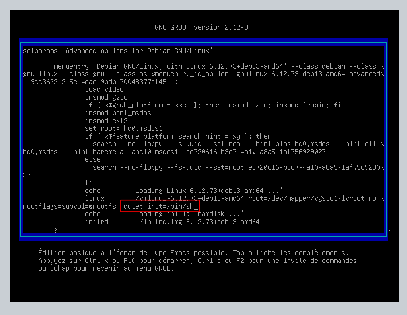

# Procédure - Compromission du GRUB sur Debian 13


---
## Informations

- **Mainteneur :** MEDO Louis
- **Date :** 06/03/2026

---
## Sommaire

- A. Compromission du serveur via GRUB

---
## A. Compromission du serveur via GRUB

1. **Appuyer sur la touche `e` lors du démarrage de la machine virtuelle.**
   
2. **Ajouter `init=/bin/sh` après `quiet` dans la ligne Linux.**


   
3. **Recherche le volume racine avec la commande `mount`.**
```bash
   # Affiche la liste des volumes
   mount
   # Exemple de résultat
   sysfs on /sys type sysfs (rw, nosuid, nodev, noexec, relatime)
   proc on /proc type proc (rw, nosuid, nodev, noexec, relatime)
   udev on /dev type devtmpfs (rw, nosuid, relatime, size=1425304k, nr_inodes=356326, mode=755, inode64)
   deupts on /dev/pts type devpts (rw, nosuid, noexec, relatime, gid=5,mode=600, ptmxmode=000)
   tmpfs on /run type tmpfs (rw, nosuid, nodev, noexec, relatime, size=290984k, mode=755, inode64)
   # Recherche la ligne contenant le volume logique root comme ci-dessous
   /dev/mapper/vgsio1-lvroot on / type btrfs (ro, relatime, discard=async, space_cache=v2, subvolid=256, subvol=/@rootfs)
```

4. **Monter le volume racine en lecture écriture.**
   ```bash
   mount -o remount, rw /
   ```

5. **Changer le mot de passe du compte.**
   ```bash
   # Exemple avec le compte étudiant
   passwd etudiant
   ```
   
6. **Redémarrer la machine physiquement et vérifier que le changement à bien fonctionner.**