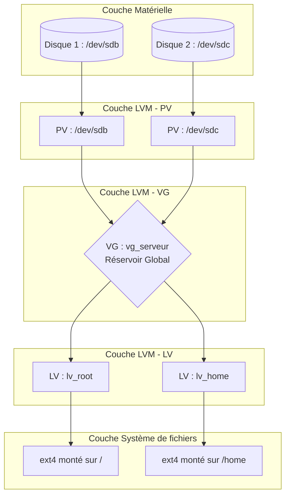

# Notions - LVM


---
## Informations

- **Mainteneur :** MEDO Louis
- **Date :** 06/03/2026

---
## Sommaire

- [A. Présentation](#a-presentation)
- [B. La problématique résolue](#b-la-problematique-resolue)
- [C. Glossaire de LVM](#c-glossaire-de-lvm)
- [D. Fonctionnement de LVM](#d-fonctionnement-de-lvm)
- [E. Exemples d'utilisation pertinents](#e-exemples-dutilisation-pertinents)

---

## A. Présentation {#a-presentation}

**LVM (Logical Volume Manager)** est un gestionnaire de volumes logiques pour les systèmes d'exploitation Linux. l introduit une couche d'abstraction entre les disques physiques (matériel) et le système de fichiers (logiciel). Cela permet de gérer l'espace de stockage de manière dynamique et extrêmement flexible.

---

## B. La problématique résolue {#b-la-problematique-resolue}

**Avec le partitionnement classique (fdisk, parted) :** L'espace de stockage est rigide. Si la partition `/home` est pleine, vous ne pouvez l'agrandir que s'il y a de l'espace libre *contigu* sur le même disque. Ajouter un nouveau disque ne permet pas d'étendre la partition existante de manière transparente.

**La solution LVM :**
LVM casse cette barrière physique. Il permet de fusionner plusieurs disques physiques en un seul "grand réservoir" d'espace virtuel, dans lequel on découpe des volumes logiques. Si un volume est plein, on peut ajouter un nouveau disque matériel au réservoir et agrandir le volume à chaud, sans interruption de service.

---

## C. Glossaire de LVM

- **PV (Physical Volume) - Volume Physique :** C'est le support de stockage matériel de base (un disque dur `/dev/sdb` ou une partition classique `/dev/sda2`) initialisé pour être utilisé par LVM.
- **VG (Volume Group) - Groupe de Volumes :** C'est le "réservoir" virtuel qui regroupe un ou plusieurs PV. On additionne leurs capacités.
- **LV (Logical Volume) - Volume Logique :** C'est l'équivalent de la partition classique. Il est découpé au sein du VG. C'est lui qu'on formate (ext4, xfs) et qu'on monte sur le système (ex: `/home`).
- **PE (Physical Extent) / LE (Logical Extent) :** L'unité de mesure de base de LVM (généralement 4 Mo). Un VG est divisé en PE, qui sont alloués aux LV sous forme de LE.

---

## D. Fonctionnement de LVM

La logique de LVM repose sur un empilement en entonnoir inversé : on part du matériel pour aller vers le système de fichiers.



**Explication de la chaîne :**

1. Les disques physiques bruts sont convertis en **PV**.
2. Ces PV sont rassemblés pour créer un **VG** (la somme de leurs capacités).
3. Dans ce VG, on "taille" des **LV** de la taille souhaitée.
4. On formate ces LV avec un système de fichiers utilisable par l'OS.

---

## E. Exemples d'utilisation pertinents

### Cas n°1 : Agrandir un volume plein avec un nouveau disque

*Contexte : Le volume `/home` (sur le VG `vg01`) est plein. J'ajoute physiquement un nouveau disque de 20GB (`/dev/sdc`) au serveur. Avec un partitionnement classique, on ne peut pas étendre `/home` sur ce nouveau disque. Avec LVM, voici comment faire :*

**1. Préparer le nouveau disque en Volume Physique (PV)**
```bash
pvcreate /dev/sdc
```
- `pvcreate` : Commande qui écrit les métadonnées LVM sur le disque pour l'initialiser en Volume Physique.
- `/dev/sdc` : Le chemin vers le nouveau disque dur matériel.

**2. Étendre le Groupe de Volumes (VG) existant**
```bash
vgextend vg01 /dev/sdc
```
- `vgextend` : Commande pour ajouter de la capacité à un Groupe de Volumes.
- `vg01` : Le nom du groupe de volumes existant.
- `/dev/sdc` : Le Volume Physique que l'on ajoute au réservoir.

**3. Agrandir le Volume Logique (LV)**
```bash
lvextend -l +100%FREE /dev/vg01/lv_home
```
- `lvextend` : Commande pour augmenter la taille d'un Volume Logique.
- `-l +100%FREE` : L'option `-l` gère les "Extents". `+100%FREE` indique à LVM d'utiliser 100% de l'espace libre nouvellement disponible dans le VG.
- `/dev/vg01/lv_home` : Le chemin absolu du Volume Logique à agrandir.

**4. Agrandir le système de fichiers (FS)**
```bash
resize2fs /dev/vg01/lv_home
```
- `resize2fs` : Commande qui étend le système de fichiers (si c'est du ext2/ext3/ext4) pour qu'il occupe le nouvel espace alloué au bloc LVM sous-jacent.

### Cas n°2 : Les Snapshots (Instantanés)

*Contexte : Avant de faire une mise à jour risquée de l'application sur `/var/www` (situé sur le volume `lv_web`), on prend un cliché à l'instant T pour pouvoir revenir en arrière en cas de crash.*

```bash
lvcreate -L 2G -s -n web_snap /dev/vg01/lv_web
```
- `lvcreate` : Commande permettant de créer un nouveau Volume Logique.
- `-L 2G` : L'option `-L` définit une taille en gigaoctets. Ici, on alloue 2 Go pour stocker **uniquement les différences** (les modifications) effectuées après la prise du cliché.
- `-s` : L'option clé qui indique à LVM de créer un **snapshot** au lieu d'un volume standard.
- `-n web_snap` : L'option `-n` (name) donne le nom "web_snap" au nouveau volume de cliché.
- `/dev/vg01/lv_web` : Le volume logique source que l'on souhaite "photographier".