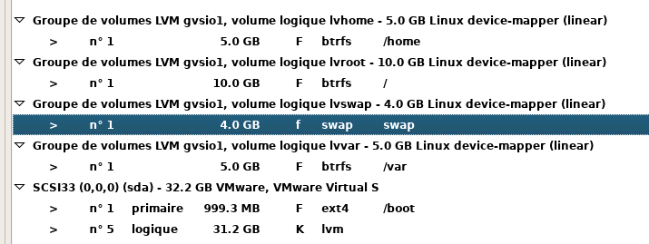

# Procédure - Partitionnement de LVM sur Debian 13

---
## Informations

- **Mainteneur :** MEDO Louis
- **Date :** 06/03/2026

---
## Sommaire

- [A. Contexte](#a-contexte)
- [B. Rappel des notions](#b-rappel-des-notions)
- [C. Configuration de LVM lors de l'installation de Debian 13](#c-configuration-de-lvm-lors-de-linstallation-de-debian-13)
- [Ressources](#ressources)

---
## A. Contexte

L'installation d'un serveur sous Debian 13 au sein de l'infrastructure IMDEO nécessite une gestion de stockage souple, sécurisée et évolutive. Cette procédure détaille l'utilisation de l'outil LVM (Logical Volume Manager) lors de la phase de partitionnement assistée de l'installateur Debian. 

L'objectif est d'abandonner le partitionnement rigide classique pour séparer logiquement les données critiques du système (racine, utilisateurs, variables système). Cela garantit qu'une partition pleine (comme `/var` avec des logs) ne bloquera pas le système entier, tout en conservant la capacité d'étendre ces espaces de stockage à chaud en cas de besoin futur.

---
## B. Rappel des notions

- **Physical Volumes (PV)** : Ce sont les disques physiques ou partitions qui serviront de base pour LVM. Ils peuvent être de différents types (HDD, SSD, etc.).
- **Volume Groups (VG)** : Un Volume Group regroupe plusieurs Physical Volumes en un seul espace logique. C’est une sorte de “pool” (réservoir) dans lequel on peut puiser pour créer des volumes logiques.
- **Logical Volumes (LV)** : Les Logical Volumes sont des morceaux du Volume Group. Ce sont eux que vous formatez et montez pour y stocker vos données. Ils fonctionnent comme des partitions, mais avec beaucoup plus de flexibilité.
- **Thin Provisioning** : C’est une fonctionnalité avancée qui permet de créer des volumes logiques sans allouer immédiatement tout l’espace. Pratique pour optimiser l’utilisation des ressources.
- **Snapshots** : Ce sont des copies instantanées d’un volume logique. Parfait pour sauvegarder ou tester des modifications.

---
## C. Configuration de LVM lors de l'installation de Debian 13

### 1. Création de la partition d'amorçage (/boot) hors LVM

*Explication : Le chargeur d'amorçage (GRUB) doit pouvoir lire le noyau Linux avant même de charger les modules complexes comme LVM. Il faut donc obligatoirement créer une partition `/boot` standard en dehors de LVM.*

1. Double-cliquez sur le disque physique cible.
2. Choisissez **Oui** pour partitionner le disque entier (création d'une table de partition vierge).
3. Double-cliquez sur l'espace libre apparu.
4. Sélectionnez **Créer une nouvelle partition**.
5. Saisissez **1 GB** *(Taille recommandée pour conserver sereinement plusieurs versions du noyau Linux au fil des mises à jour).*
6. Choisissez le type **Primaire**.
7. Choisissez l'emplacement au **Début**.
8. Configurez les paramètres de la partition ainsi :

    - Utiliser comme : `système de fichiers journalisé ext4`
    - Point de montage : `/boot`

9. Sélectionnez **Fin du paramétrage de cette partition**.

### 2. Création des volumes logiques (LVM)

*Explication : Nous allons transformer l'espace libre restant en un grand réservoir LVM (le VG), puis y découper nos différents volumes (les LV).*

1. Sélectionnez **Configurer le gestionnaire de volumes logiques (LVM)**.
2. Confirmez l'écriture des changements sur le disque en sélectionnant **Oui**.
3. **Création du Groupe de Volumes (VG) :**

    1. Cliquez sur **Créer un groupe de volumes**.
    2. Nommez-le (ex: `vg_imdeo` ou `vgsio1`).
    3. Cochez l'espace libre restant sur le disque (qui deviendra automatiquement le PV) et confirmez.

4. **Création des Volumes Logiques (LV) :**
    
    1. Cliquez sur **Créer un volume logique**.
    2. Sélectionnez le groupe de volumes parent (`vg_imdeo`).
    3. Nommez le volume logique (ex: `lvhome`).
    4. Définissez la taille (ex: `5 GB`).
    5. Répétez l'opération "Créer un volume logique" pour chaque volume requis.

5. Une fois tous les volumes créés, sélectionnez **Terminer**.

!!! info "Infrastructure IMDEO"
      En plus de la partition standard `/boot`, l'infrastructure nécessite la création de 4 Volumes Logiques distincts pour isoler les données : 

      - Un volume pour la racine (`lvroot`)
      - Un volume pour les utilisateurs (`lvhome`)
      - Un volume pour les données variables/logs (`lvvar`)
      - Un volume pour la mémoire virtuelle (`lvswap`)

### 3. Configuration des systèmes de fichiers et points de montage

*Explication : Les conteneurs LVM sont prêts. Il faut maintenant les formater avec un système de fichiers et indiquer à Linux quel dossier système associer à quel volume.*

De retour sur l'écran principal de partitionnement, configurez chaque espace sous la section LVM :

1. **Sur le volume `lvhome` :**
    - Utiliser comme : `système de fichiers journalisé btrfs`
    - Point de montage : `/home` *(Pour isoler les données personnelles des utilisateurs)*
2. **Sur le volume `lvroot` :**
    - Utiliser comme : `système de fichiers journalisé btrfs`
    - Point de montage : `/` *(La racine du système d'exploitation)*
3. **Sur le volume `lvvar` :**
    - Utiliser comme : `système de fichiers journalisé btrfs`
    - Point de montage : `/var` *(Pour isoler les logs et éviter qu'ils ne saturent le système)*
4. **Sur le volume `lvswap` :**
    - Utiliser comme : `espace d'échange ("swap")` *(Pour la mémoire virtuelle)*

### 4. Finalisation de l'installation

1. Vérifiez attentivement le récapitulatif des partitions et des points de montage.

2. Sélectionnez **Terminer le partitionnement et appliquer les changements**.
3. Confirmez une dernière fois en choisissant **Oui** pour écrire les données sur les disques et poursuivre l'installation de Debian 13.

---
## Ressources

- [Documentation LVM - Q. Demouliere](https://qdemouliere.github.io/sisr1/documentation/Linux/02--Lvm/)